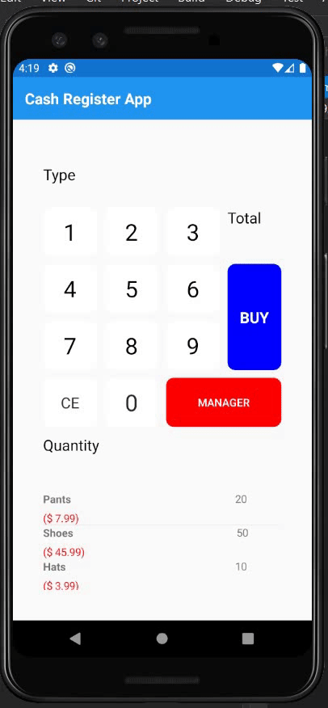
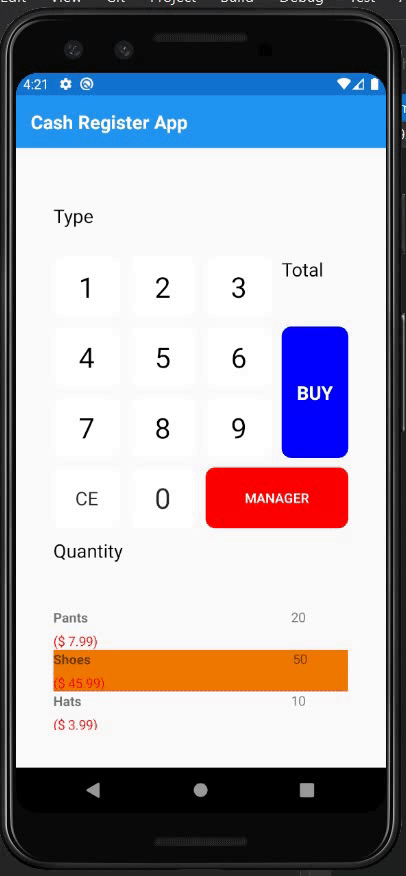
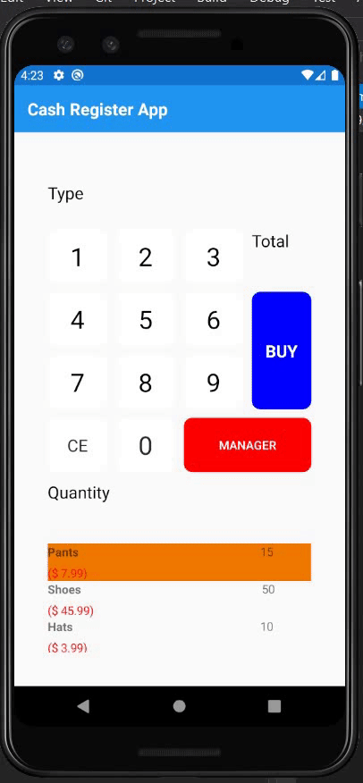
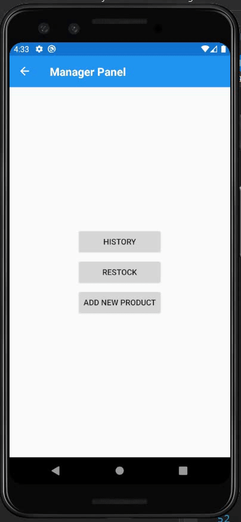
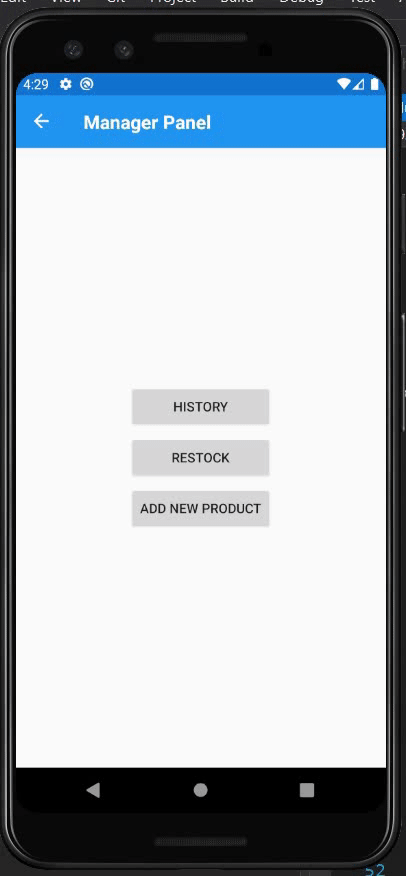

# DPS926 - Assignment 1 - Xamarin Cash Register App

**Buying a product without input**

Clicking the "Buy" button without entering quantity or type of product.

 

**Buying a product without enough stock**

Buying 55 shoes when there are only 50 in stock, error alert is shown.

 

**Buying a product**

Buying 5 pants from a stock of 20 pants, end result is 15 pants.

 

**Checking purchase history**

Seeing details of the 5 pants we bought.

 

**Restocking Product**

Restocking pants from 0 to 25.

 

**Restocking Product In correct**

Restocking product without specifying which one. Error alert is shown.

 

**Adding Product**

Add baseball caps to the list of products.

**Adding Product Incorrectly**

Add product without filling out all fields, error alert is shown.

